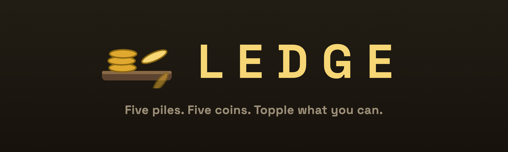
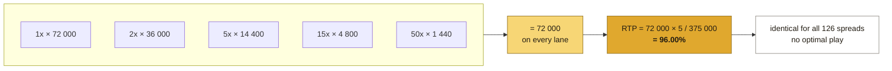
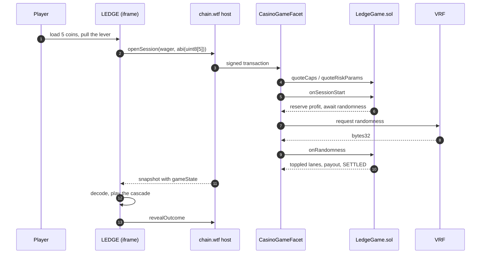
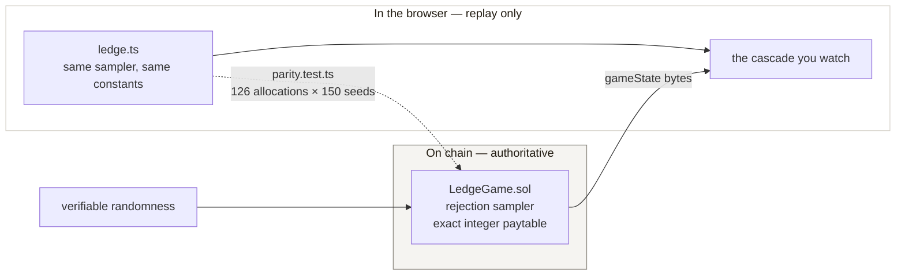

<p align="center">
  
</p>

<p align="center">
  <b>Chain Jam Vol. 1 entry.</b><br>
  <a href="https://sepolia.basescan.org/address/0x5d07b33fa3c335b65b10313ff6b9db487020afc4">Live on Base Sepolia</a>
  · 96.00% RTP · provably fair
</p>

---

## Vision

> **A casino game with nowhere to hide the edge — the paytable is the board you are aiming at, the odds move on screen as you bet, and all 126 possible spreads return exactly the same 96%.**

Most casino games ask you to trust a number written somewhere else. LEDGE draws it. The
prize is the pile you are trying to knock over, the chance of knocking it over is printed
above it, and no way of splitting your coins is better than any other.

## The game

Five priced piles sit on a ledge. You get five coins. Spread them across the lanes and
keep whatever topples.

| Pile | 1x | 2x | 5x | 15x | 50x |
| --- | --- | --- | --- | --- | --- |
| Chance with 1 coin | 19.2% | 9.6% | 3.84% | 1.28% | 0.384% |
| Chance with 5 coins | 96.0% | 48.0% | 19.2% | 6.4% | 1.92% |

Bigger pile, bigger prize, harder to shift. **Every coin is worth the same expected return
wherever you drop it** — the lane only chooses your volatility.

## Why the 96% cannot be gamed

Each lane's topple chance is set so that `prize × threshold` is the same constant on every
lane:



Because the product is constant, the expected value of a coin is the same on every lane,
so the return is fixed no matter how you split them. Worst-case payout is 73x — under the
100x heavy-tail threshold — so the tiered jackpot reserve path never engages.

## How a bet travels

The page holds no wallet and signs nothing. It asks the host to open a session, then waits
for the chain to say what happened.



`revealOutcome` matters: until it is called the host hides the payout, so the balance
cannot spoil a result the animation has not reached.

## What you have to trust

The contract decides. The browser only replays what it already decided — and a test holds
the two together.



If those ever disagreed the game would show one result and pay another. That is the single
failure this project guards hardest against.

## Quick start

```sh
npm install
npm start          # local chain + VRF + simulator (:3300) + the game (:3101)
```

Open <http://localhost:3300>, expand the setup panel, set **Game contract** to `LedgeGame`,
then **Restart harness**. Or open <http://localhost:3101> for the standalone demo.

```sh
npm --prefix examples/ledge test    # 86 tests
```

## Live

| | |
| --- | --- |
| Contract | [`0x5d07b33f…20afc4`](https://sepolia.basescan.org/address/0x5d07b33fa3c335b65b10313ff6b9db487020afc4) on Base Sepolia |
| Verified | all 126 allocations and 150 random seeds cross-checked against the deployed bytecode |
| RTP | 96.00%, declared and proven |

A deployed contract cannot take a bet until the Chain.wtf team whitelists it on
`CasinoGameFacet`. That is theirs to do; send them the address and the hosted URL.

## Where things are

| Path | What it is |
| --- | --- |
| [`examples/ledge/`](./examples/ledge) | The game — frontend, math, tests |
| [`examples/ledge/DESIGN.md`](./examples/ledge/DESIGN.md) | The math, derived, and why the design is what it is |
| [`examples/ledge/ARCHITECTURE.md`](./examples/ledge/ARCHITECTURE.md) | Bet lifecycle, round state machine, trust boundary |
| [`simulator/contracts/LedgeGame.sol`](./simulator/contracts/LedgeGame.sol) | The game contract (`ICasinoGameV2`) |
| [`scripts/deploy-ledge.ts`](./scripts/deploy-ledge.ts) | Deploys to Base; dry run by default |

## Deploying

```sh
cp .env.example .env.deploy        # fill in RPC + deployer key
set -a; . ./.env.deploy; set +a
npm run deploy:ledge                        # dry run — sends nothing
LEDGE_CONFIRM=84532 npm run deploy:ledge    # broadcast to Base Sepolia
```

Host from the **repository root**, never from `examples/ledge` — the game is a workspace
package depending on `@chain/casino-sdk` via `file:../..`. See
[examples/ledge/README.md](./examples/ledge/README.md#3-host-the-frontend).

## What is mine and what is vendored

`examples/ledge/`, `simulator/contracts/LedgeGame.sol`, `scripts/` and the hosting config
at the root are this entry's own work.

The rest is the **Chain casino SDK v0.2.0**, vendored unmodified as the build baseline —
`src/`, the remainder of `simulator/`, `local-verify-network/`, `docs/` and
`examples/coinflip-public/`. Its own README is kept at [`docs/SDK_README.md`](./docs/SDK_README.md).
