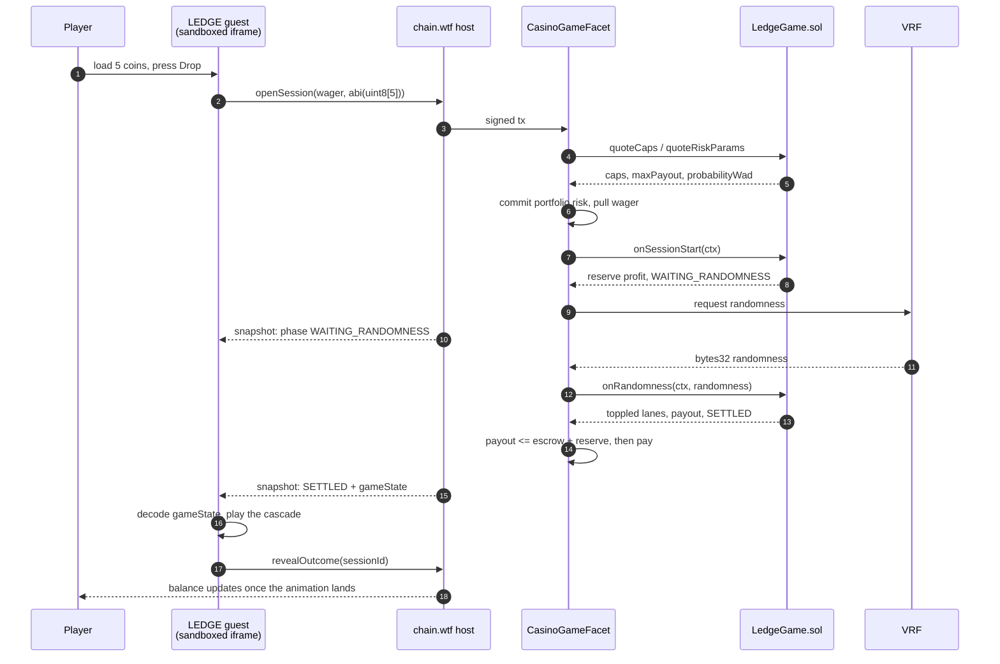
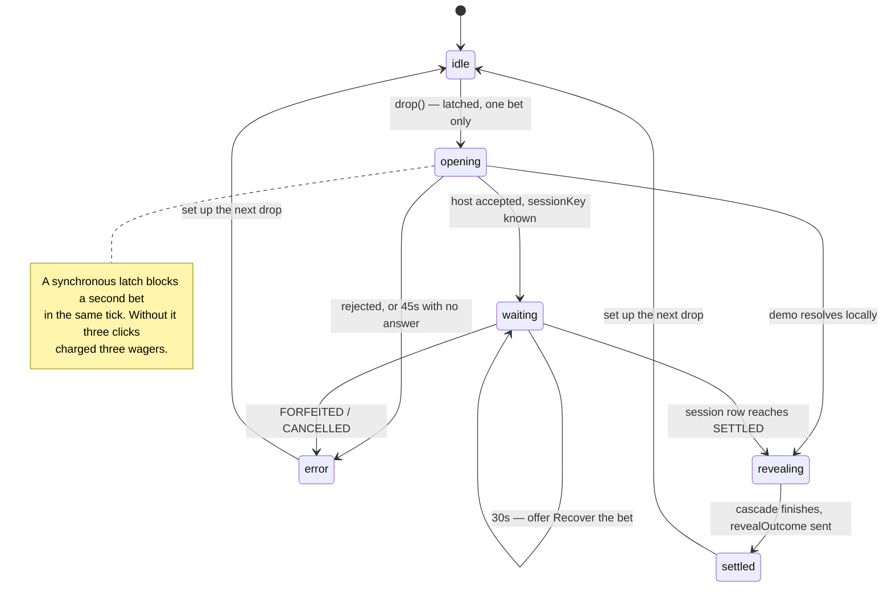
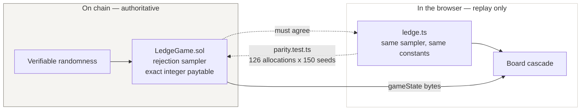

# LEDGE — how it fits together

Three diagrams: where a bet goes, what the UI is doing while it waits, and which
parts you have to trust.

## A bet, end to end

The guest holds no wallet and signs nothing. It asks the host to open a session, then
waits for the chain to tell it what happened.

`revealOutcome` matters: until it is called the host hides the payout from its own balance
display, so the top bar cannot spoil a result the animation has not reached yet.

## What the UI is doing

One round, one state machine. The demo path exists because the jam requires the game to
be playable standalone, and the guest can never sign a real bet on its own.

## What you have to trust

The contract decides the outcome. The TypeScript mirror only re-derives it so the
animation can replay what already happened — and `parity.test.ts` holds the two together
across all 126 allocations and 150 random seeds.

If those two ever disagreed, the game would show one result and pay another. That is the
single failure this project guards hardest against.

## The numbers, in one place

| | |
| --- | --- |
| Prizes | `1x, 2x, 5x, 15x, 50x` of the full stake |
| Topple thresholds | `72000, 36000, 14400, 4800, 1440` over `375000` per coin |
| Invariant | `prize x threshold = 72000` on every lane |
| Declared RTP | **96.00%**, identical for all 126 allocations |
| Worst-case payout | 73x — under the 100x heavy-tail threshold, so that reserve path never engages |
| Randomness | 3-byte draws, reject `>= 16500000`, then `% 375000`; re-hash the seed when it runs out |

Full derivation: [DESIGN.md](./DESIGN.md).
